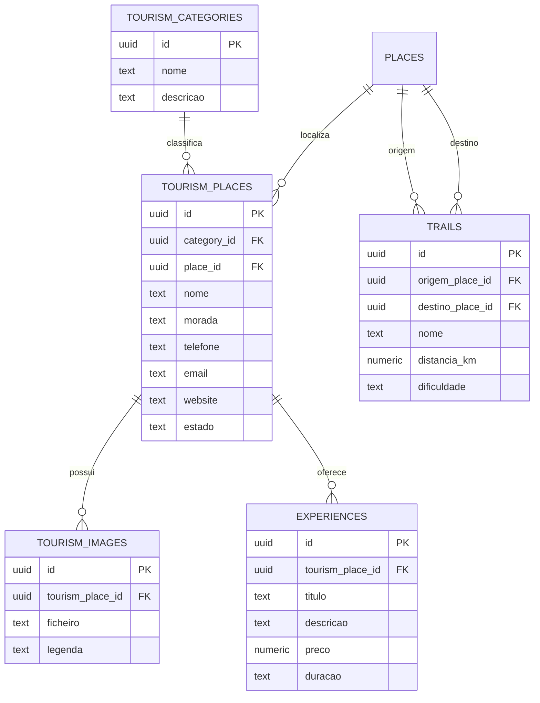

# OTJ — Fase 4
# Capítulo 10 — ERD do Módulo do Turismo

## Objetivo

Definir o diagrama ERD detalhado do módulo de Turismo da plataforma OTJ, suportando alojamentos, restaurantes, pontos de interesse, trilhos e experiências.

---

## Diagrama ERD (Mermaid)

---

## Cardinalidades

- Categoria de Turismo (1:N) Locais Turísticos
- Lugar (1:N) Locais Turísticos
- Local Turístico (1:N) Imagens
- Local Turístico (1:N) Experiências
- Lugar (1:N) Trilhos (origem e destino)

---

## Índices Recomendados

- tourism_places(category_id)
- tourism_places(place_id)
- trails(origem_place_id)
- trails(destino_place_id)
- experiences(tourism_place_id)
- tourism_images(tourism_place_id)

---

## Observações

Este módulo integra-se com Agenda e Eventos, Marketplace e Notificações, permitindo promover o património, o turismo rural e as atividades locais.

---

## Próximo Capítulo

**Capítulo 11 — ERD do Módulo da Biblioteca e Conteúdos**.
