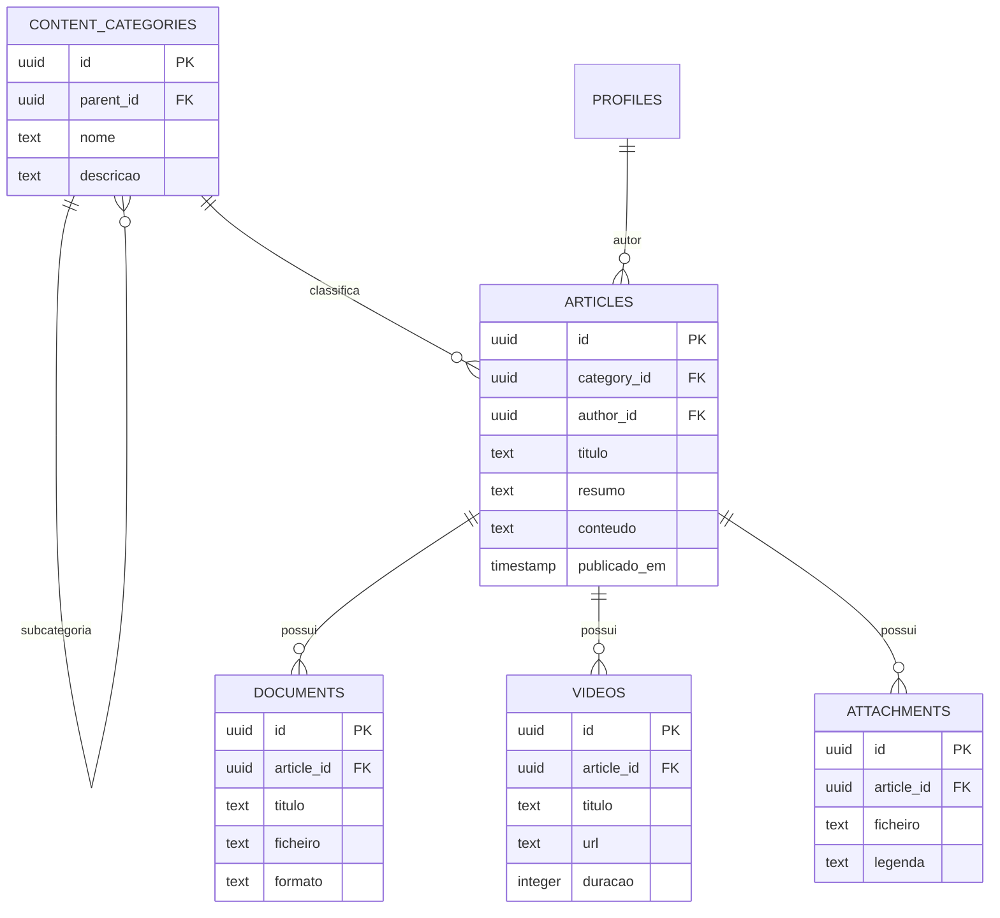

# OTJ — Fase 4
# Capítulo 11 — ERD do Módulo da Biblioteca e Conteúdos

## Objetivo

Definir o diagrama ERD detalhado do módulo da Biblioteca e Conteúdos, responsável pela organização do conhecimento da plataforma OTJ.

---

## Diagrama ERD (Mermaid)

---

## Cardinalidades

- Categoria (1:N) Subcategorias
- Categoria (1:N) Artigos
- Perfil (1:N) Artigos
- Artigo (1:N) Documentos
- Artigo (1:N) Vídeos
- Artigo (1:N) Anexos

---

## Índices Recomendados

- content_categories(parent_id)
- articles(category_id)
- articles(author_id)
- documents(article_id)
- videos(article_id)
- attachments(article_id)

---

## Observações

Este módulo centraliza todo o conhecimento da plataforma, permitindo a organização de documentação técnica, guias, artigos, vídeos e outros recursos.

---

## Próximo Capítulo

**Capítulo 12 — ERD do Módulo das Notificações**.
