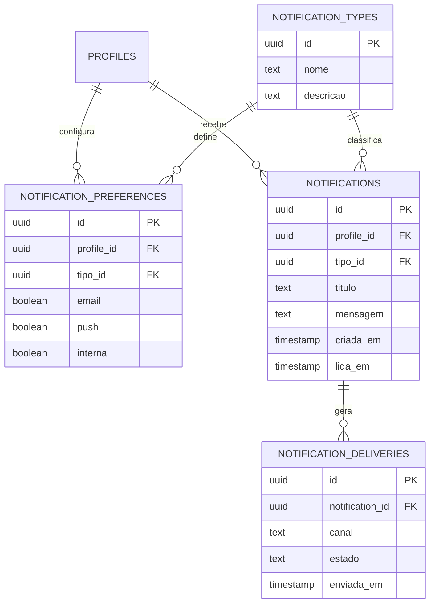

# OTJ — Fase 4
# Capítulo 12 — ERD do Módulo das Notificações

## Objetivo

Definir o diagrama ERD detalhado do módulo de Notificações da plataforma OTJ, permitindo gerir alertas, mensagens internas, emails e notificações push.

---

## Diagrama ERD (Mermaid)

---

## Cardinalidades

- Perfil (1:N) Preferências
- Tipo de Notificação (1:N) Preferências
- Perfil (1:N) Notificações
- Tipo de Notificação (1:N) Notificações
- Notificação (1:N) Entregas

---

## Índices Recomendados

- notification_preferences(profile_id, tipo_id)
- notifications(profile_id)
- notifications(tipo_id)
- notifications(criada_em)
- notification_deliveries(notification_id)
- notification_deliveries(estado)

---

## Observações

Este módulo centraliza todas as comunicações da plataforma e permite adicionar novos canais de entrega sem alterar o restante sistema.

---

## Próximo Capítulo

**Capítulo 13 — ERD do Módulo da Administração**.
