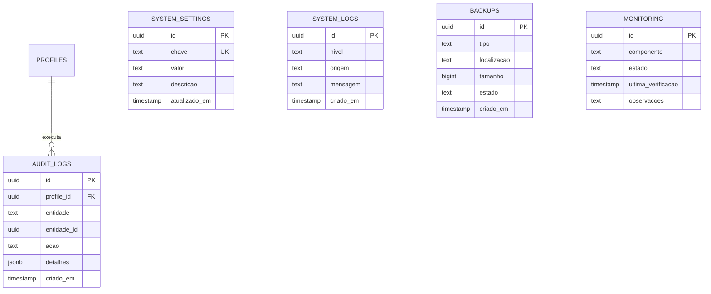

# OTJ — Fase 4
# Capítulo 13 — ERD do Módulo da Administração

## Objetivo

Definir o diagrama ERD detalhado do módulo de Administração, responsável pela configuração, auditoria, monitorização, segurança e operação da plataforma OTJ.

---

## Diagrama ERD (Mermaid)

---

## Cardinalidades

- Perfil (1:N) Auditoria
- Configurações → Sistema
- Logs → Sistema
- Backups → Sistema
- Monitorização → Sistema

---

## Índices Recomendados

- system_settings(chave) UNIQUE
- audit_logs(profile_id)
- audit_logs(entidade)
- audit_logs(criado_em)
- system_logs(nivel)
- monitoring(componente)
- backups(criado_em)

---

## Observações

Este módulo fornece mecanismos de gestão e supervisão da plataforma, garantindo rastreabilidade, segurança e suporte operacional.

---

## Próximo Capítulo

**Capítulo 14 — ERD Global da Plataforma OTJ**.
