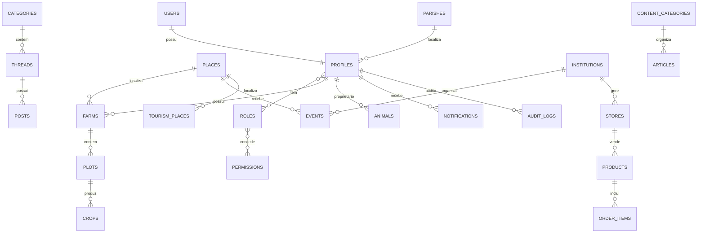

# OTJ — Fase 4
# Capítulo 14 — ERD Global da Plataforma OTJ

## Objetivo

Apresentar uma visão global da arquitetura da base de dados do projeto **O Tio do Joca (OTJ)**, demonstrando a ligação entre todos os módulos principais.

---

## ERD Global (Visão Simplificada)

---

## Módulos Integrados

1. Autenticação
2. Localização
3. Comunidade
4. Agricultura
5. Animais
6. Agenda e Eventos
7. Entidades Institucionais
8. Marketplace
9. Turismo
10. Biblioteca e Conteúdos
11. Notificações
12. Administração

---

## Princípios da Arquitetura

- Modular e escalável.
- Baseada em PostgreSQL/Supabase.
- Normalizada.
- Preparada para RLS.
- Preparada para APIs, PWA e aplicações móveis.
- Fácil de expandir com novos módulos.

---

## Resultado da Fase 4

Foram produzidos diagramas ERD para todos os módulos principais da plataforma, juntamente com um diagrama global que serve como referência para a implementação da base de dados.

## Próxima Fase

**Fase 5 — Implementação Física da Base de Dados**, onde o modelo será convertido em SQL completo para PostgreSQL/Supabase, incluindo tabelas, índices, restrições, políticas RLS e migrações.
