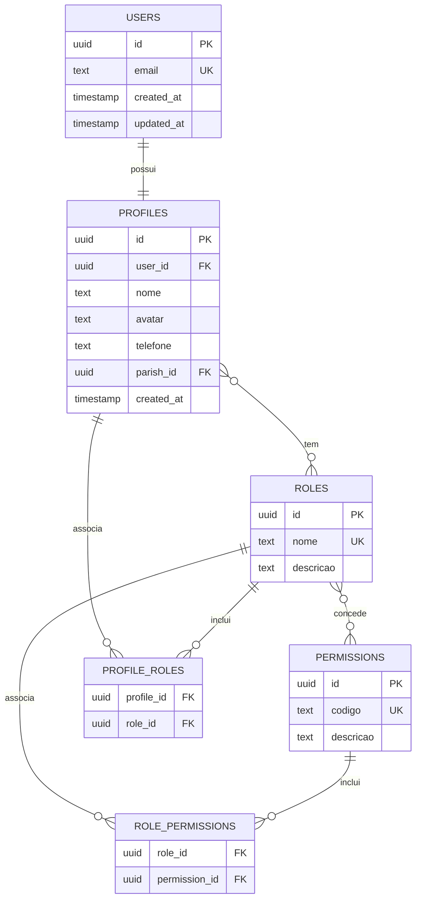

# OTJ — Fase 4
# Capítulo 2 — ERD do Núcleo de Autenticação

## Objetivo

Definir o primeiro diagrama ERD detalhado do OTJ, correspondente ao núcleo de autenticação e autorização da plataforma.

---

## Diagrama ERD (Mermaid)

---

## Cardinalidades

- Users (1:1) Profiles
- Profiles (N:N) Roles
- Roles (N:N) Permissions

---

## Índices Recomendados

- users.email (UNIQUE)
- profiles.user_id (UNIQUE)
- roles.nome (UNIQUE)
- permissions.codigo (UNIQUE)
- profile_roles(profile_id, role_id)
- role_permissions(role_id, permission_id)

---

## Observações

Este módulo serve de base para todo o controlo de acesso da plataforma e será utilizado por todos os restantes módulos.

---

## Próximo Capítulo

**Capítulo 3 — ERD do Módulo de Localização**.
