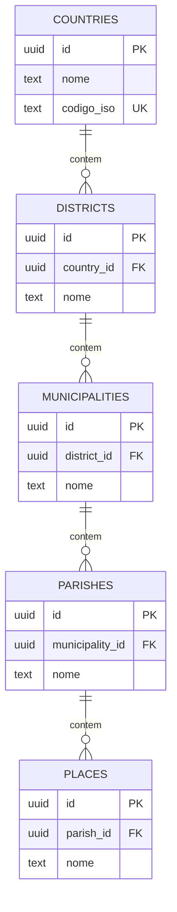

# OTJ — Fase 4
# Capítulo 3 — ERD do Módulo de Localização

## Objetivo

Definir o diagrama ERD detalhado da hierarquia territorial do OTJ, que servirá de base para todos os módulos que dependem da localização.

---

## Diagrama ERD (Mermaid)

---

## Cardinalidades

- Country (1:N) Districts
- District (1:N) Municipalities
- Municipality (1:N) Parishes
- Parish (1:N) Places

---

## Índices Recomendados

- countries.codigo_iso (UNIQUE)
- districts(country_id, nome)
- municipalities(district_id, nome)
- parishes(municipality_id, nome)
- places(parish_id, nome)

---

## Utilização

Este módulo será referenciado por:

- Perfis
- Explorações agrícolas
- Animais
- Eventos
- Instituições
- Marketplace
- Turismo

Centralizar a localização evita duplicação de dados e garante consistência em toda a plataforma.

---

## Próximo Capítulo

**Capítulo 4 — ERD do Módulo da Comunidade**.
