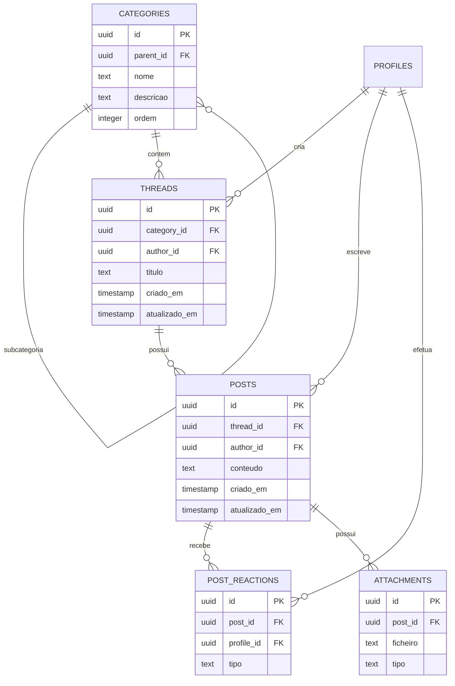

# OTJ — Fase 4
# Capítulo 4 — ERD do Módulo da Comunidade

## Objetivo

Definir o diagrama ERD detalhado do módulo da Comunidade, responsável pelo fórum, categorias, tópicos, mensagens, reações e anexos.

---

## Diagrama ERD (Mermaid)

---

## Cardinalidades

- Categoria (1:N) Subcategorias
- Categoria (1:N) Tópicos
- Perfil (1:N) Tópicos
- Tópico (1:N) Mensagens
- Perfil (1:N) Mensagens
- Mensagem (1:N) Reações
- Perfil (1:N) Reações
- Mensagem (1:N) Anexos

---

## Índices Recomendados

- categories(parent_id, nome)
- threads(category_id)
- threads(author_id)
- posts(thread_id)
- posts(author_id)
- post_reactions(post_id, profile_id)
- attachments(post_id)

---

## Observações

Este módulo constitui o núcleo social da plataforma OTJ, suportando discussões, partilha de conhecimento e colaboração entre utilizadores.

---

## Próximo Capítulo

**Capítulo 5 — ERD do Módulo da Agricultura**.
