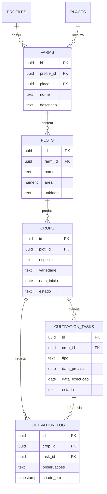

# OTJ — Fase 4
# Capítulo 5 — ERD do Módulo da Agricultura

## Objetivo

Definir o diagrama ERD detalhado do módulo de Agricultura, abrangendo explorações, parcelas, culturas, tarefas e registos agrícolas.

---

## Diagrama ERD (Mermaid)

---

## Cardinalidades

- Perfil (1:N) Explorações
- Lugar (1:N) Explorações
- Exploração (1:N) Parcelas
- Parcela (1:N) Culturas
- Cultura (1:N) Tarefas
- Cultura (1:N) Registos
- Tarefa (1:N) Registos

---

## Índices Recomendados

- farms(profile_id)
- farms(place_id)
- plots(farm_id)
- crops(plot_id)
- cultivation_tasks(crop_id, estado)
- cultivation_log(crop_id)
- cultivation_log(task_id)

---

## Observações

Este módulo suporta o acompanhamento completo do ciclo de cultivo, desde a organização da exploração até ao histórico de operações efetuadas.

---

## Próximo Capítulo

**Capítulo 6 — ERD do Módulo dos Animais**.
