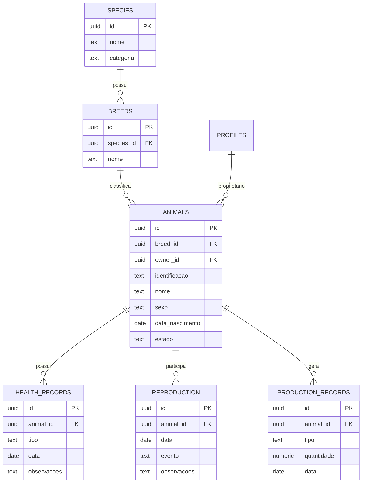

# OTJ — Fase 4
# Capítulo 6 — ERD do Módulo dos Animais

## Objetivo

Definir o diagrama ERD detalhado do módulo dos Animais, suportando a gestão de espécies, raças, animais, sanidade, reprodução e produção.

---

## Diagrama ERD (Mermaid)

---

## Cardinalidades

- Espécie (1:N) Raças
- Raça (1:N) Animais
- Perfil (1:N) Animais
- Animal (1:N) Registos Sanitários
- Animal (1:N) Registos de Reprodução
- Animal (1:N) Registos de Produção

---

## Índices Recomendados

- breeds(species_id)
- animals(breed_id)
- animals(owner_id)
- animals(identificacao) UNIQUE
- health_records(animal_id)
- reproduction(animal_id)
- production_records(animal_id)

---

## Observações

Este módulo permite acompanhar todo o ciclo de vida dos animais, desde a identificação até ao histórico sanitário e produtivo.

---

## Próximo Capítulo

**Capítulo 7 — ERD do Módulo da Agenda e Eventos**.
