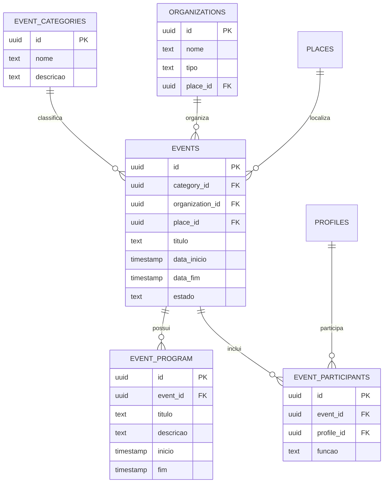

# OTJ — Fase 4
# Capítulo 7 — ERD do Módulo da Agenda e Eventos

## Objetivo

Definir o diagrama ERD detalhado do módulo da Agenda e Eventos, permitindo gerir feiras, festas, romarias, mercados, exposições e outras iniciativas.

---

## Diagrama ERD (Mermaid)

---

## Cardinalidades

- Categoria de Evento (1:N) Eventos
- Organização (1:N) Eventos
- Lugar (1:N) Eventos
- Evento (1:N) Programa
- Evento (1:N) Participantes
- Perfil (1:N) Participações

---

## Índices Recomendados

- events(category_id)
- events(organization_id)
- events(place_id)
- events(data_inicio)
- event_program(event_id)
- event_participants(event_id)
- event_participants(profile_id)

---

## Observações

Este módulo centraliza a divulgação e gestão de eventos locais, permitindo integração com instituições, turismo e notificações.

---

## Próximo Capítulo

**Capítulo 8 — ERD do Módulo das Entidades Institucionais**.
