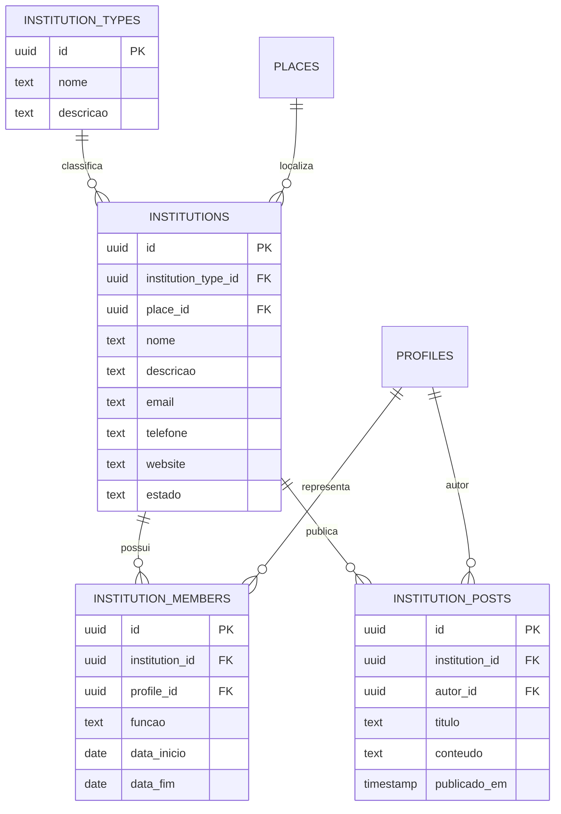

# OTJ — Fase 4
# Capítulo 8 — ERD do Módulo das Entidades Institucionais

## Objetivo

Definir o diagrama ERD detalhado das entidades institucionais da plataforma OTJ, permitindo gerir organismos oficiais, associações e os seus representantes.

---

## Diagrama ERD (Mermaid)

---

## Cardinalidades

- Tipo de Entidade (1:N) Entidades
- Lugar (1:N) Entidades
- Entidade (1:N) Representantes
- Perfil (1:N) Representações
- Entidade (1:N) Publicações
- Perfil (1:N) Publicações

---

## Índices Recomendados

- institutions(institution_type_id)
- institutions(place_id)
- institutions(nome)
- institution_members(institution_id)
- institution_members(profile_id)
- institution_posts(institution_id)
- institution_posts(autor_id)

---

## Observações

Este módulo permite às entidades institucionais gerir conteúdos, eventos e informação oficial, mantendo uma ligação direta ao território e aos respetivos representantes.

---

## Próximo Capítulo

**Capítulo 9 — ERD do Módulo do Marketplace**.
