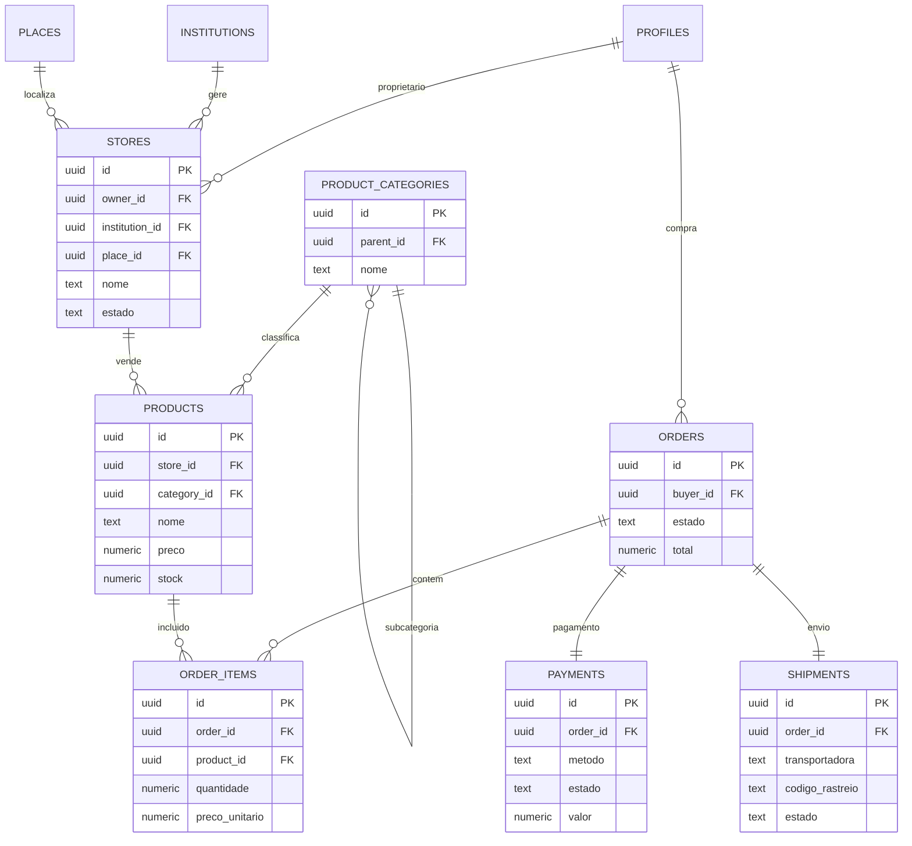

# OTJ — Fase 4
# Capítulo 9 — ERD do Módulo do Marketplace

## Objetivo

Definir o diagrama ERD detalhado do Marketplace do OTJ, suportando lojas, produtos, encomendas, pagamentos e envios.

---

## Diagrama ERD (Mermaid)

---

## Cardinalidades

- Perfil (1:N) Lojas
- Instituição (1:N) Lojas
- Loja (1:N) Produtos
- Categoria (1:N) Produtos
- Encomenda (1:N) Itens
- Produto (1:N) Itens da Encomenda
- Encomenda (1:1) Pagamento
- Encomenda (1:1) Envio

---

## Índices Recomendados

- stores(owner_id)
- stores(institution_id)
- products(store_id)
- products(category_id)
- order_items(order_id)
- order_items(product_id)
- payments(order_id)
- shipments(order_id)

---

## Observações

O Marketplace foi concebido para suportar produtores, artesãos, comerciantes e instituições, permitindo futura expansão para faturação, múltiplos vendedores e logística.

---

## Próximo Capítulo

**Capítulo 10 — ERD do Módulo do Turismo**.
