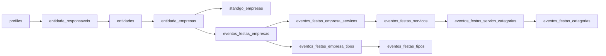

# Eventos & Festas — V1 profissional

## Objetivo e conceitos

Diretório de empresas e profissionais para organizar celebrações em Portugal e na Diáspora. `eventos`, `calendar_events` e `/espectaculos` continuam a representar acontecimentos concretos, agenda e bilhetes. Nenhuma dessas tabelas/rotas foi substituída.

**REPETIÇÃO EVITADA:** identidade em `entidades`, dados empresariais/verificação em `entidade_empresas`, gestão em `entidade_responsaveis`, reivindicações em `entidade_pedidos`, imagens em `entidades.fotografias`. Não há empresas independentes por serviço, novo storage, novo chat ou sistema duplicado de favoritos.

**EVOLUÇÃO:** extensão profissional, catálogos SQL extensíveis, pesquisa, perfis, adesão/gestão, moderação e localização internacional.

## Arquitetura



| Tabela / contrato | Função |
| --- | --- |
| `eventos_festas_empresas` | Presença 1:1 com a empresa transversal, estado, capacidade e área de serviço |
| `eventos_festas_categorias` | 24 categorias profissionais |
| `eventos_festas_servicos` | 274 serviços únicos, slugs, sinónimos, notas e disponibilidade no catálogo |
| `eventos_festas_servico_categorias` | N:N: um serviço pode aparecer em várias categorias, sem duplicação |
| `eventos_festas_tipos` | 59 tipos, incluindo oito entradas principais; subtipos agrupados e sinónimos |
| `eventos_festas_empresa_servicos` | N:N empresa ↔ serviços |
| `eventos_festas_empresa_tipos` | N:N empresa ↔ tipos de evento |
| `eventos_festas_diretorio` | View pública com campos explícitos e filtro obrigatório de publicação |

Chaves compostas impedem associações repetidas. Índices inversos apoiam pesquisa por serviço/tipo/categoria. Slugs são chaves estáveis dos catálogos; nomes visíveis não autorizam operações. Novas profissões e tipos entram como dados, sem novas colunas booleanas. Catálogos são carregados da base de dados, não mantidos como listas React.

O catálogo abrange espaços, catering, pastelaria, fotografia, vídeo, música, animação, decoração, flores, material, som/luz, produção, transportes, vestuário, beleza, papelaria, lembranças, segurança, limpeza, organização, cerimónias, crianças, alojamento/experiências e complementares. Serviços partilhados como geradores, palcos, hotéis e streaming têm uma única entrada e várias categorias.

Idades são sinónimos de aniversários especiais. “Despedida de casado” é sinónimo de festa de divórcio/separação e aparece na interface. Licenças de drone, segurança, lasers, celebrantes e performances não são presumidas pela presença no catálogo.

## Identidade, responsáveis e adesão

`eventos_festas_minhas_empresas()` lista apenas entidades geridas pelo utilizador autenticado, incluindo entidades sem extensão empresarial/vertical. Uma pessoa pode gerir várias empresas; vários responsáveis podem gerir a mesma empresa. Os papéis proprietário, administrador e gestor editam o perfil. Colaboradores não recebem poderes de alteração da identidade transversal.

Fluxo implementado:

1. Autenticação pelo sistema OTJ; middleware preserva MFA existente.
2. Escolher entidade já gerida, procurar uma entidade pública pelo nome e pedir acesso, ou criar entidade nova.
3. Selecionar serviços e tipos de evento, completar os dados públicos e a presença.
4. Guardar rascunho ou submeter para moderação.
5. Administração publica/suspende a presença; os pedidos de acesso exigem decisão administrativa.

A RPC de escrita é atómica e verifica `auth.uid()` e responsabilidade no servidor. Cria `entidade_empresas` quando necessário e reutiliza a entidade existente. Nome, contactos, fotografias e localização são partilhados entre módulos, facto indicado no formulário. Não aceita `profile_id`, proprietário, verificação ou estado arbitrário fornecidos pelo browser.

Criação usa proteção contra duplicados por nome normalizado + país + localidade/freguesia, com bloqueio para submissões concorrentes equivalentes. Isto não resolve automaticamente variações comerciais do nome, filiais ou equivalências fiscais: a pesquisa prévia e a análise humana continuam necessárias. Não se fundem entidades automaticamente.

Reivindicações reutilizam `entidade_pedidos` com `codigo_atividade='eventos-festas'`; um pedido não cria empresa nem concede acesso. `/eventos-festas/administracao` resolve o pedido e cria/reativa a responsabilidade transversal depois da confirmação administrativa. O mecanismo não envia mensagens externas nem faz convites automáticos. Convites por username/email podem futuramente usar a mesma relação.

## Estados, autorização e privacidade

- Presença: `rascunho`, `pendente`, `ativo`, `suspenso`.
- Público: somente presença `ativo` **e** entidade `publicado`.
- Novo perfil/submissão fica pendente. A aprovação administrativa publica a entidade pendente/validada e ativa a presença.
- Empresa ativa pode atualizar o perfil. Guardar como rascunho retira a presença do diretório e exige nova submissão/aprovação para voltar.
- Responsáveis não conseguem remover a suspensão.
- Verificação é o `verificada` transversal e é independente da publicação. Alterar nome ou país retira uma verificação anterior, exigindo revisão.

Tabelas verticais têm RLS e nenhuma política de escrita direta para clientes. As RPC autenticadas controlam as alterações. As funções administrativas verificam `profiles.role='admin'` na base de dados; a UI também verifica antes de apresentar as ações.

A view pública usa deliberadamente permissões do proprietário, `security_barrier` e filtro explícito de estado. Não expõe IDs de responsáveis, perfis, nome legal, NIF ou informações administrativas. A pesquisa é invoker e lê apenas essa view. Os perfis não fazem `select('*')` em dados empresariais. A migration transversal de privacidade retira o SELECT integral em `entidade_empresas` e permite apenas `entidade_id`, `pais_codigo`, `tipo_organizacao`, `verificada` aos clientes, ainda sujeitos à RLS.

Dados internos de requerentes só aparecem na área administrativa protegida. Contactos públicos são os da entidade, nunca o email autenticado do responsável por omissão.

## Portugal e Diáspora

Auditoria: `entidades.freguesia_id` era obrigatório e `localizacoes` exige código postal português. Usar localizações falsas impediria uma representação correta das empresas estrangeiras.

A migration permite `freguesia_id=NULL` e acrescenta `entidades.regiao/localidade`. O país continua em `entidade_empresas.pais_codigo`; não se duplica identidade nem país empresarial. As FKs e índices portugueses são preservados. O formulário preserva a freguesia existente em Portugal; uma mudança para o estrangeiro remove essa associação e a localização postal portuguesa no servidor, exigindo localidade.

A pesquisa combina texto, serviço, categoria, tipo/subtipo, país, localização e capacidade mínima, com páginas de 24 resultados. A localização consulta freguesia, concelho, distrito, região, localidade, lugar e área de serviço. Texto usa normalização de acentos e pesquisa portuguesa com nomes, descrições, serviços, tipos e sinónimos.

Limites V1: país validado como código de duas letras; área de serviço é texto declarado; não há validação postal internacional, pesquisa por distância ou polígonos. Novas empresas portuguesas podem começar com localidade/região; a escolha de freguesia por autocomplete fica para evolução do editor transversal. As associações portuguesas existentes não são alteradas sem mudança de país.

## Integrações

- **StandGo:** uma entidade com duas extensões e os mesmos responsáveis/contactos. Não é necessária a migration StandGo para criar o módulo Eventos & Festas; a coexistência é testada com ambas.
- **Restauração/alojamento/comércio:** reutilizar `entity_id` das pontes da migration `20260913140000_fase_f_ponte_entidades_verticais_entity_id.sql`. Não criar outro restaurante/hotel. Registos antigos ainda sem essa ponte exigem associação revista; não inferir equivalência por nome automaticamente.
- **Imagens/portefólio:** usa referências de `entidades.fotografias`, até 12. Primeira imagem como capa/logótipo, restantes como trabalhos. A UI aceita imagens HTTPS alojadas na origem de storage OTJ e mantém a CSP global. Não cria bucket nem copia ficheiros. Álbuns, vídeos, legendas e upload dedicado ficam para evolução.
- **Horários:** infraestrutura transversal existente continua disponível; não foi duplicada nem foi acrescentado editor de horários ao módulo.
- **Favoritos:** os favoritos existentes são de anúncios/eventos, não de empresas genéricas; não foram usados com IDs de natureza errada. Integração futura deverá referenciar `entidades`.
- **Mensagens:** o sistema OTJ existente está orientado a perfis/conversas. Futuro contacto empresarial deve resolver destinatários autorizados no servidor através da entidade; a V1 apresenta apenas contactos públicos.
- **Orçamentos/avaliações:** podem referenciar `entidade_id`, serviços/tipos e utilizador sem mudar a identidade. Não foram criados fluxos parciais de pagamentos, contratos, reservas ou chat.
- **Qualificações/licenças:** notas de catálogo não são prova; futuros documentos/validações podem referenciar a empresa e o serviço. Nenhuma licença fictícia é anunciada.

## Rotas e interface

| Rota | Implementação |
| --- | --- |
| `/eventos-festas` | Entrada, tipos principais e categorias, ligação a adesão |
| `/eventos-festas/empresas` | Diretório e filtros combinados |
| `/eventos-festas/empresas/[slug]` | Perfil profissional público, contactos, serviços, tipos, imagens e verificação |
| `/eventos-festas/[tipo]` | Casamentos, aniversários, festas infantis, despedidas, eventos empresariais e restantes tipos do catálogo |
| `/eventos-festas/servicos` | Catálogo organizado por categoria |
| `/eventos-festas/servicos/[slug]` | Serviço; também resolve slugs de categoria como fotografia |
| `/eventos-festas/categorias/[slug]` | Categoria profissional |
| `/eventos-festas/aderir` | Escolher, procurar/reivindicar ou criar entidade |
| `/eventos-festas/painel` e `/painel/[id]` | Gestão autenticada |
| `/eventos-festas/administracao` | Publicação/suspensão e pedidos de acesso |

Entrada adicionada à página principal OTJ. Paleta rosa/vinho, espaços claros e grelhas responsivas, independente do visual StandGo. Componentes sem dependências novas. Metadados por tipo, serviço e empresa; páginas privadas não indexáveis. Estado indisponível explícito se as migrations ainda não estiverem aplicadas. Sem dados de demonstração no código de produção.

## Migrations e ordem futura de aplicação

**Criadas nesta entrega:**

1. `20260915200000_entidades_diaspora_privacidade_v1.sql`
2. `20260915203000_eventos_festas_profissionais_v1.sql`

**Migrations anteriores alteradas nesta entrega:** nenhuma. Os ficheiros empresariais e StandGo pendentes da sessão anterior mantêm-se.

Dependências: schema base OTJ (`entidades`, `profiles`, `categorias_entidade`, `freguesias`, `localizacoes`, `entidade_pedidos`), autenticação Supabase e `20260915190000_entidades_empresas_transversal_v1.sql`.

Ordem da série empresarial:

1. `20260915190000_entidades_empresas_transversal_v1.sql` — identidade empresarial/responsáveis.
2. `20260915193000_standgo_empresas_v1.sql` — quando se aplicar a presença StandGo; independente de Eventos & Festas.
3. `20260915200000_entidades_diaspora_privacidade_v1.sql` — nulabilidade internacional e permissões públicas.
4. `20260915203000_eventos_festas_profissionais_v1.sql` — extensão, catálogos, políticas, view e RPC.

Nenhuma migration foi aplicada remotamente, nenhum `supabase db push`/reset foi executado. Não há DROP de tabelas ou limpeza de dados existentes. A troca de seleções pela RPC remove somente associações que o responsável retirou explicitamente no formulário, dentro da transação.

### Riscos conhecidos antes de aplicação real

- Rever o histórico real de migrations antes de aplicar os ficheiros empresariais pendentes; migrations não são scripts de reaplicação manual.
- Fazer replay completo em staging com o schema e dados reais. Os testes locais usam tabelas centrais reais e fixtures reduzidas para perfis/pedidos/verticais; não substituem esse replay.
- Consumidores externos que assumam freguesia não nula ou façam `select('*')` em `entidade_empresas` precisam de revisão. No código auditado, a integração pública tolera freguesia ausente e os novos consumidores selecionam campos explícitos.
- A gestão altera dados partilhados. Responsabilidade transversal deve ser atribuída apenas após confirmação da ligação à empresa.
- Pesquisa textual agrega relações em tempo de consulta, adequada à V1. Medir volume antes de acrescentar índice de pesquisa materializado; índices de associação já existem.
- Capacidade V1 é da oferta principal da empresa. Vários espaços com capacidades distintas poderão ter ofertas referenciadas à mesma entidade, sem duplicar a empresa.
- Antes de aplicar, confirmar política editorial e operação humana da fila de moderação. Não há publicação/verificação automática de novas empresas.

## Testes e execução

```sh
python3 scripts/eventos-festas/verify-local.py
npx vitest run lib/eventos-festas/validation.test.ts
npx playwright test --config=playwright.eventos-festas.config.ts
npx tsc --noEmit
npm run lint
git diff --check
```

O runner SQL usa exclusivamente o contentor local `supabase_db_otiodojoca`, cria uma base com nome aleatório e remove apenas essa base no fim. Verifica N:N, adesão sem duplicação, responsabilidade, privacidade, publicação, suspensão, convivência StandGo/restaurante/hotel, Diáspora, pesquisa e preservação da agenda.

Os testes de browser usam Next real, respostas Supabase de fixture em loopback, catálogo lido da migration e bloqueio de rede externa. Testam UI/Server Actions; a autorização SQL é exercitada separadamente contra PostgreSQL real. Não executar em paralelo com a bateria Espetáculos, pois reutilizam `.next-e2e` e os auxiliares de fonte/rede. Captura mobile em `/tmp/eventos-festas-perfil-mobile.png`.

Resultados locais: SQL passou; oito testes de validação passaram; cinco cenários mobile passaram (quatro na bateria e o cenário de gestão repetido isoladamente após corrigir o seletor do teste). TypeScript passou na verificação final, após o encerramento do servidor de testes. ESLint global terminou com zero erros e 321 avisos preexistentes; o conjunto de ficheiros novos/alterados do módulo não apresentou avisos. `git diff --check` passou. A captura do perfil mobile foi inspecionada e os testes confirmaram ausência de overflow horizontal.

As fixtures não provam integração remota nem substituem staging. Funcionalidades avançadas mantêm-se futuras: reservas/disponibilidade, orçamentos completos, avaliações/moderação de avaliações, favoritos de entidades, mensagens empresariais, convites, licenças documentais, geolocalização avançada e múltiplos espaços/ofertas por empresa.
